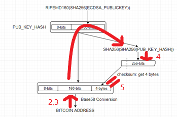

# Sample to Bitcoin Address Validation

This is a sample code for Bitcoin Address Validation. Transactions provide to transfer assets between Bitcoin wallets that keep private
key and bitcoin address. Private key ensure that the transaction comes from the owner of the wallet. You can also check how to bitcoin
address and private key are generated from [here](https://github.com/burakcanekici/BitcoinAddressGenerator)

There are several wallets type such as cold and hot wallets. Cold storage wallets mean you keep your private key and bitcoin address
as offline. Due to keeping it without network, bitcoin address owner responsible to keep it securely. Paper Wallet is regarded as a
type of Cold Storage Wallet. Basically, it keeps bitcoin address and private key independent from any digital environment or
computer. Therefore, it is used for hold your assets as long term, not for instant buy-sold activities.

There are many clint-side bitcoin wallet generator that generates bitcoin address and private key. In generally, remembering the
bitcoin address and private key are not easy, because they occured from various of numbers and characters. Therefore, its keep as
QR code on paper and easily read through QR Code from mobile app or such apps.

After generating the blockchain address, you can check balance and transactions belong to this address from here;
https://www.blockchain.com/btc/address/[BitcoinAddress]. Although client-side pages or other sources generate bitcoin address without
send any information to outside, we can check our balance and transactions and balance shows as 0 BTC. Also, we get an error as
"Checksum does not exist!", when we change one character of our bitcoin address. This sample explain how to we ensure that our
bitcoin address is valid. You can see steps at below figure;  



Let's start to examine how to we can validate bitcoin address;
- **Step #1:** Get the value we want to check whether it is valid.
```
bitcoinAddress = input("Enter a bitcoin address:")
print("--------------------------------------")
print("Bitcoin Address: ", bitcoinAddress)
```
- **Step #2:** We apply Base58 decoding to value that gets at Step #1.
```
base58Decoder = base58.b58decode(bitcoinAddress).hex()
print("Base58 Decoder: ", base58Decoder)
```
- **Step #3:** Value that is created at Step #2 holds network&hash and checksum value. We try to check this checksum value for
validate bitcoin address.
```
prefixAndHash = base58Decoder[:len(base58Decoder)-8]
checksum = base58Decoder[len(base58Decoder)-8:]
print("\t|___> Prefix & Hash: ", prefixAndHash)
print("\t|___> Checksum: ", checksum)
print("--------------------------------------")
```
- **Step #4:** According to above figure we apply SHA256 hash to value that is created from Step #3 as Prefix & Hash.
```
hash = prefixAndHash
for x in range(1,3):
    hash = hashlib.sha256(binascii.unhexlify(hash)).hexdigest()
    print("Hash#", x, " : ", hash)
print("--------------------------------------")
```
- **Step #5:** The first 4 bytes of value that is created at Step #4 is named as Checksum. Therefore cheksum value that is created at
Step #3 must be equal to this value.
```
if(checksum == hash[:8]):
    print("[TRUE] checksum is valid!")
else:
    print("[FALSE] checksum is not valid!")
```

Finally, this result is comprised;
```
Enter a bitcoin address:1Lw5rqh94dWzArQ9tDY6Ucswxo3Ums7VWi
--------------------------------------
Bitcoin Address:  1Lw5rqh94dWzArQ9tDY6Ucswxo3Ums7VWi
Base58 Decoder:  00daa4e87dcb30d406d24f76bcc2afe2ef550c9068b0a511fb
	|___> Prefix & Hash:  00daa4e87dcb30d406d24f76bcc2afe2ef550c9068
	|___> Checksum:  b0a511fb
--------------------------------------
Hash# 1  :  1d7d571d176f378eabd73b1e3ac0fb5a688855d41ae5ee8956afb9c13b5c7027
Hash# 2  :  b0a511fb05bcf1872be44d98dad592c9641fe47ee7f48f1ecee18b6805bd4ba4
--------------------------------------
[TRUE] checksum is valid!
```
